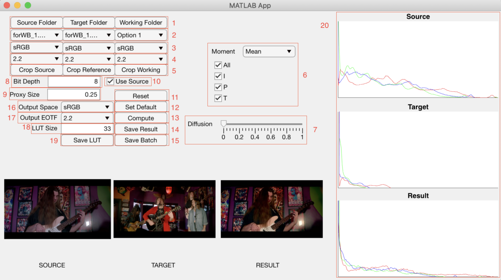

# dCoupST

## Standalone Application
To install the standalone application, first download the MATLAB Runtime library (R2021a v9.10) for your operating system [here](https://www.mathworks.com/products/compiler/mcr/index.html), and run the program from the directory corresponding with your OS with the following commands:

MacOS/Linux >>
```
./run dCoupST.sh <mcr_directory>
```

Windows >> 

Basic operation: select source folder (1) -> select source file from drop down (2) -> select target folder (1) -> select target file from drop down (2) -> compute results (13) -> save result (14)

Further features and specifications are explained below:



1. Source, target, working folder - open file browser to select directories for source, target, and working images
2. File drop-down - select source, target, and working images
3. Color Space drop-down - select color encoding (options: sRGB (default), BT.2020, ProPhoto, ARRI (AWG))*If you don't know, continute with default.
4. EOTF drop-down - select non-linear transfer function (options: 2.2 (default), 2.4, 1 (linear))*
5. Crop Source/Target/Working - Specify an image region to derive a transfer between source and target images, or a specific region in the working image to apply the transfer
6. Moment drop-down, color channel boxes - Select features to transfer. For each statistical moment (mean - average value, variance - contrast, skew - high key/low key, kurtosis - black/white concentration) the user can select the specific channels to transfer (I - intensity/brightness, P - protan or red/green axis, or T - tritan or blue/yellow axis). A moment can only be transferred for a color channel if all moments above it on the list are also transferred for that channel. So if the user selects "I" for Kurtosis, "I" will automatically be checked for Skew, Variance, and Mean. If "P" is de-selected for Mean, "P" will be automatically de-selected for Variance, Skew and Kurtosis.
7. Diffusion slider - Linear adjustment of diffusion transfer. If set to one, the diffusion transfer matching source to target is applied. If set to zero, only the color transfer is applied. The slider can be adjusted anywhere in the 0-1 range to blend between the diffusion+color transfer and the color only transfer and the resulting image will be shown in real time.
8. Bit Depth - set bit depth of images for one color channel. Most images should be 8 bit, but if the images are showing up dim or black, try 10,12, or 16. Similarly, if images are showing up pure white or blown out, try a lower bit depth.
9. Proxy Size - Downscale images for faster computation. Compute full sized images by setting to 1. Transforms can be derived with a downscaled image, and then can be rapidly applied to the full scale by setting to 1 and pressing compute again.
10. Use Source - Use source image as working image (this is the default setting - the transform derived between source and target is applied directly to the source.) If source is cropped, working image can be set to the source to apply the transform derived from the cropped version to the full image.
11. Reset - Return to default settings
12. Set default - Set new default settings
13. Compute - Process images given current parameters
14. Save result - Open browser to set save directory, process and save results, as well as params.mat file. If cropping is used, the cropped source and target are saved as well.
15. Save batch - Open browser to select full directory of images to apply pre-computed transforms (compute first, then save batch.)
16. Output space - Set display color encoding (options: sRGB (default), BT.2020, DCI.P3 D65, DCI.P3 D50)*
17. Output EOTF - Set monitor electro-optical transfer function (options: 2.2 (default), 2.4)
18. LUT Size - Set 3D LUT precision (33x33x33 default - should be precise enough for 8 or 10 bit images)
19. Save LUT - open browser to specify file name and output directory for .cube 3D LUT
20. Source, target and result histograms - Pixel counts per code value for red, green, and blue channels of source, target, and result images

## Source Code
Users can interact with the matlab code directly by calling mainControlST.m 
```
[out,moments,kernel,lut] = mainControlST(W,S,R,params)
```
Inputs: full range, double n x m x 3 image arrays W, S, and R corresponding to working, source, and target images, and struct 'params'. This is best populated by running the standalone application described above or dCoupSTplus.mlapp, setting all of the parameters in the GUI, and pressing save result, which saves the resulting image as well as a file params.mat, which can be loaded and passed to the mainControlST function.

Otherwise, the function can be populated with the following values.

* params.lutSize - [double] number of nodes in LUT (default: 33)
* params.moms - [5x3 double] with columns linked to mean, variance, skew, kurtosis, diffusion respectively, and rows associated with I,P and T color channels. Mean, variance, skew and kurtosis should be 0 or 1 values indicating on/off for the transfer. Diffusion channels can be fed anything in the 0-1 range.
* params.depth - [integer] single-channel bit depth value (8, 10, 12, etc.)
* params.resizeF - [double] resize value in 0-1 range
* params.sCSin - [string within cell] 'sRGB' (default), 'BT.2020', 'ProPhoto', 'ARRI'
* params.sGamIn - [double] source encoding non-linearity (1.0, 2.2, 2.4, etc.)
* params.rCSin - [string within cell] 'sRGB' (default), 'BT.2020', 'ProPhoto', 'ARRI'
* params.rGamIn - [double] target encoding non-linearity (1.0, 2.2, 2.4, etc.)
* params.csOut - [string within cell] 'sRGB', 'BT.2020', 'DCI.P3.D65', 'DCI.P3.D50'
* params.gamOut - [double] display non-linearity (1.0, 2.2, 2.4, etc.)
